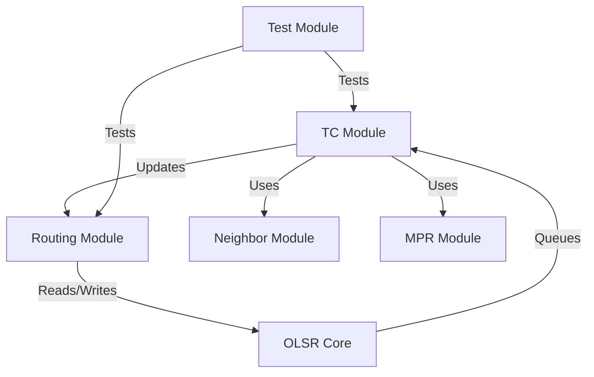
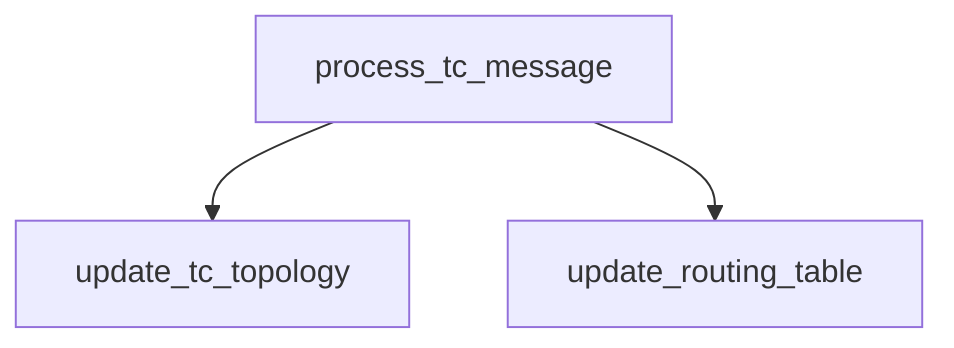
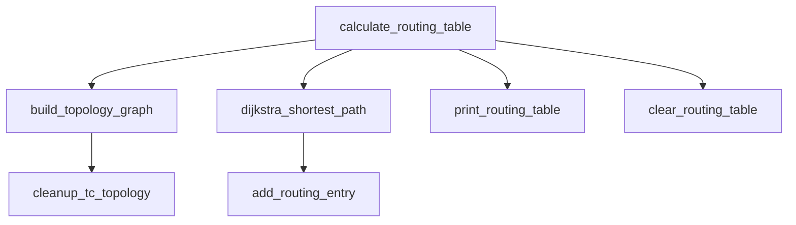

# OLSR Project Design Document

## Overview
This document describes the design and control flow of the OLSR (Optimized Link State Routing) implementation. It details the main modules, their functions, and how control flows between them.

---

## Module Structure

### 1. Topology Control (tc)
- **process_tc_message(struct olsr_message* msg, uint32_t sender_addr)**: Handles incoming TC messages, updates topology, and triggers routing table updates.
- **add_mpr_selector(uint32_t selector_addr)**: Adds a node as an MPR selector.
- **remove_mpr_selector(uint32_t selector_addr)**: Removes a node from MPR selectors.
- **send_tc_message(void)**: Sends a TC message to the network.
- **get_mpr_selector_count(void)**: Returns the number of current MPR selectors.
- **get_current_ansn(void)**: Returns the current Advertised Neighbor Sequence Number.
- **push_tc_to_queue(struct control_queue* queue)**: Pushes a TC message to the control queue.

### 2. Routing (routing)
- **update_tc_topology(uint32_t from_addr, uint32_t to_addr, time_t validity)**: Updates the topology graph with new TC info.
- **cleanup_tc_topology(void)**: Cleans up expired topology entries.
- **build_topology_graph(struct topology_link* topology, int max_links)**: Builds the topology graph for routing calculations.
- **dijkstra_shortest_path(uint32_t source, struct topology_link* topology, int link_count)**: Computes shortest paths using Dijkstra's algorithm.
- **calculate_routing_table(void)**: Main function to recalculate the routing table.
- **add_routing_entry(uint32_t dest_ip, uint32_t next_hop, uint32_t metric, int hops)**: Adds an entry to the routing table.
- **print_routing_table(void)**: Prints the current routing table.
- **clear_routing_table(void)**: Clears all routing entries.
- **update_routing_table(void)**: Updates the routing table, typically after topology changes.

### 3. Neighbor Management (neighbor)
- **update_neighbor(uint32_t neighbor_addr, int link_type, uint8_t willingness)**: Updates information about a neighbor.
- **add_neigbhor(uint32_t neighbor_addr, int link_type, uint8_t willingness)**: Adds a new neighbor.

### 4. MPR (mpr)
- **add_two_hop_neighbor(uint32_t two_hop_addr, uint32_t one_hop_addr)**: Manages two-hop neighbor relationships for MPR selection.

### 5. OLSR Core (olsr)
- **init_control_queue(struct control_queue* queue)**: Initializes the control message queue.
- **push_to_control_queue(struct control_queue* queue, uint8_t msg_type, const uint8_t* msg_data, size_t data_size)**: Pushes a message to the control queue.
- **pop_from_control_queue(struct control_queue* queue, struct control_message* out_msg)**: Pops a message from the control queue.

### 6. Test (mpr_test)
- **init_test_environment(void)**: Sets up the test environment.
- **test_star_topology(void)**: Tests the star topology scenario.
- **test_chain_topology(void)**: Tests the chain topology scenario.

---

## Control Flow Diagrams

### High-Level Module Interaction

### Function Control Flow

#### TC Message Processing

#### Routing Table Calculation

---

## Module Interactions
- **TC module** receives and processes TC messages, updating the topology and triggering routing updates.
- **Routing module** maintains the network graph and computes optimal paths.
- **Neighbor and MPR modules** manage neighbor relationships and MPR selection, feeding into TC and routing logic.
- **OLSR core** handles message queuing for protocol operations.
- **Test module** provides test scenarios for validation.

---

## Summary
This design ensures modularity and clear separation of concerns. The control flow is primarily event-driven, with TC messages triggering topology and routing updates, and routing logic maintaining up-to-date paths for data forwarding.

---

**Note:** The above diagrams use Mermaid syntax. To view them as rendered diagrams, use a Markdown viewer or tool that supports Mermaid (e.g., VSCode with the Markdown Preview Mermaid Support extension, or GitHub/GitLab web interfaces).
